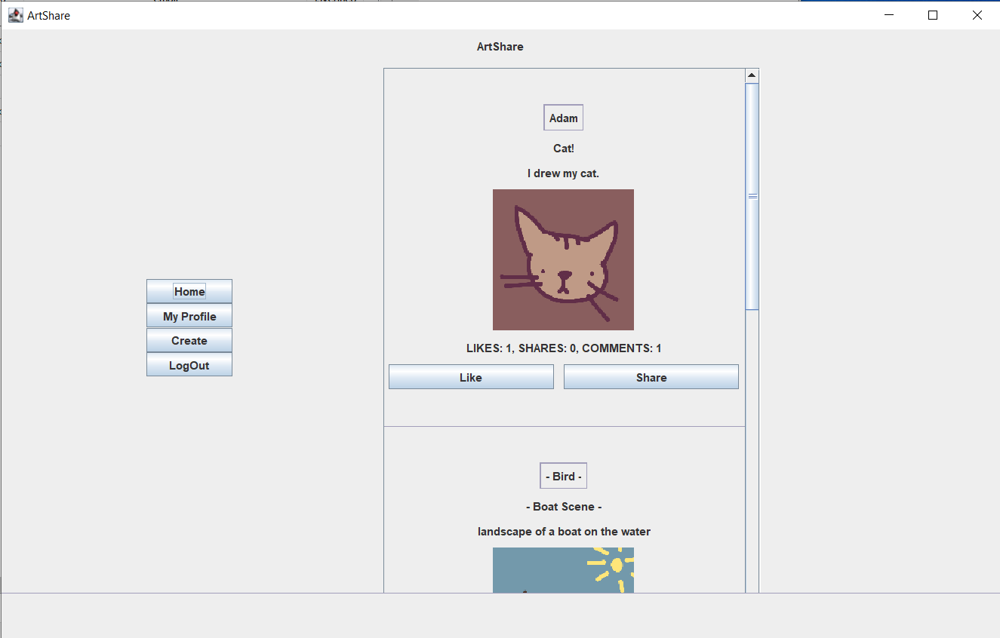

# ArtShare

A mock-up social media platform for artists developed in Java using Swing and JavaFX, with SQLite database.
Created for college modules: Object Oriented Software Development and Design, System Analysis & Testing

---

## Features

- Sign up / log in with saved user info
- Create posts with images
- Like/comment/share posts created by other users
- main feed showing posts from other users

---

Created by [Adam Noonan](https://github.com/FloppaDev4000)  & Dalia Herdes
